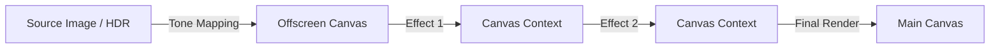

# BrowserImageFX

[](https://www.gnu.org/licenses/agpl-3.0)
[](https://react.dev/)
[](https://www.typescriptlang.org/)
[](https://vite.dev/)

**BrowserImageFX** is a modern, client-side image processing studio for the web. Load an image, stack multiple visual effects, and export the result without ever leaving the browser or uploading files to a server.

> [!TIP]
> **Try the Live Demo:** [https://kododake.github.io/BrowserImageFX/](https://kododake.github.io/BrowserImageFX/)

---

## Highlights

- 🔁 **Composable Effect Pipeline** – Apply, reorder, toggle, and remove stacked effects with instant feedback.
- 🎚️ **Rich Parameter Controls** – Fine-tune effect parameters through accessible shadcn/ui components backed by Zustand state.
- 🖼️ **Canvas-Driven Preview** – Rendering stays on the client via an extensible `EffectPipeline` that targets the HTML Canvas 2D context.
- 🌈 **HDR Pipeline** – WebGL2-based tone mapping converts `.hdr` (RGBE) images to SDR before the effect stack processes them.
- ⚡ **Modern Stack** – Built with Vite, React 19, and TypeScript for a fast, strictly typed workflow.
- 🧰 **Effect Library & Stack** – Browse brightness, contrast, LUT, vignette, temperature, and blur effects, then reorder them from the stack panel or mobile sheet.
- 🎨 **Glassmorphism UI** – Tailwind-powered dark layout with responsive zoom controls and keyboard-friendly interactions.

## Tech Stack

| Category | Technology |
|----------|------------|
| **Core** | [React 19](https://react.dev/), [TypeScript](https://www.typescriptlang.org/), [Vite](https://vite.dev/) |
| **Styling** | [Tailwind CSS](https://tailwindcss.com/), [Radix UI](https://www.radix-ui.com/), [lucide-react](https://lucide.dev/) |
| **State** | [Zustand](https://github.com/pmndrs/zustand) |
| **Graphics** | HTML5 Canvas 2D, WebGL2 (for HDR) |

## Getting Started

### Prerequisites

- Node.js (v18 or later recommended)

### Installation

```bash
npm install
npm run dev
````

The dev server runs on `http://localhost:5173/`.

### Production Build

```bash
npm run build
npm run preview   # optional: preview the production bundle
```

## Architecture & Concepts

### Pipeline Overview

The application uses a sequential pipeline to process images entirely in the browser.



- **Effect Contracts** (`src/core/effects/types.ts`): Defines the `IEffect` interface (`apply`, `renderControls`).
- **State Management** (`src/store/effects.ts`): Zustand store that manages the order and parameters of the effect stack.
- **HDR Workflow**:
  1. `RgbeLoader` decodes `.hdr` files.
  2. `ToneMappingRenderer` (WebGL2) converts linear float data to SDR.
  3. The result is fed into the standard 2D Canvas pipeline.

## Directory Structure

```text
src/
├── components/         # React components
│   ├── editor/         # Canvas workspace & zoom controls
│   ├── layout/         # Panels for Library and Stack
│   └── ui/             # Generic UI primitives (shadcn-style)
├── core/               # Core logic (Non-React)
│   ├── Pipeline.ts     # Main processing engine
│   ├── effects/        # Individual effect implementations
│   └── hdr/            # HDR loader and WebGL renderer
├── store/              # Zustand state stores
└── lib/                # Utilities
```

## Available Effects

- **Brightness** – Percentage-based exposure control with live preview.
- **Contrast** – Emphasize shadows and highlights by stretching color ranges.
- **Color LUT** – Blend cinematic presets including neutral, cool, warm, and filmic looks.
- **Vignette** – Darken edges with radius, softness, and strength sliders.
- **Color Temperature** – Kelvin-inspired slider that shifts white balance between warm and cool.
- **Gaussian Blur** – Softens details using a configurable blur radius.

## Extending BrowserImageFX

Contributions are welcome\! Adding a new effect is straightforward:

1. **Create Class**: Extend `BaseEffect` in `src/core/effects/`. Implement the `apply()` method using standard Canvas 2D API.
2. **Build UI**: Implement `renderControls()` to return React components (Sliders, Switches) for parameter tuning.
3. **Register**: Add your effect to the `definitions` array in `src/core/effects/registry.ts`.

## Roadmap

- [x] Core visual effects (Brightness, Contrast, LUT, Vignette, Color Temperature, Gaussian Blur)
- [ ] Undo/Redo history support
- [ ] Save/Load effect stack presets
- [ ] WebGL-backed filters for better performance
- [ ] WebGPU pipeline (GPU effects with Canvas fallback)

## Support the Developer

If you find this project useful, please consider making a donation to support its development.

**Bitcoin:**

```text
bc1qnpqpfq7e8pjtlqj7aa6x2y2c9ctnpts5u9lx7v
```

## License

Copyright (C) 2025 kododake.

This project is licensed under the **GNU Affero General Public License v3.0**.  
See the [LICENSE](https://github.com/kododake/BrowserImageFX?tab=AGPL-3.0-1-ov-file) file for details.

---

## BrowserImageFX (日本語)

BrowserImageFX は、ブラウザ内で完結するモダンな画像処理スタジオです。画像を読み込み、複数のエフェクトを積み重ね、サーバーに送信することなくリアルタイムに編集・書き出しが可能です。

> [\!TIP]
> **デモを試す:** [https://kododake.github.io/BrowserImageFX/](https://kododake.github.io/BrowserImageFX/)

### 主な特徴

- 🔁 **エフェクトパイプラインの合成** – エフェクトの追加・並べ替え・削除を即時反映。
- 🎚️ **豊富なパラメーター調整** – Zustand と shadcn/ui ベースの UI で直感的な操作。
- 🌈 **HDR 対応** – WebGL2 トーンマッピングにより、`.hdr` 画像を SDR に変換して編集可能。
- ⚡ **モダンな開発環境** – React 19 + TypeScript + Vite による高速な開発体験。
- 🧰 **エフェクトライブラリ** – 明るさ・コントラスト・LUT・ヴィネット・色温度・ぼかしをデスクトップとモバイルのパネルで簡単に切り替え可能。

### セットアップ

```bash
npm install
npm run dev
```

### アーキテクチャの概要

- **エフェクト契約**: 全エフェクトは共通のインターフェース (`IEffect`) を実装します。
- **パイプライン**: 元画像をオフスクリーンキャンバスにコピーし、スタック順に処理を適用して描画します。
- **HDRワークフロー**: `.hdr` ファイルを WebGL2 で現像し、通常の画像処理パイプラインに渡します。

### 利用可能なエフェクト

- **明るさ (Brightness)** – 露光量をパーセンテージで微調整。
- **コントラスト (Contrast)** – 階調を強調して陰影を際立たせます。
- **カラーLUT (Color LUT)** – シネマティックなプリセットをブレンドし、色味を一括調整。
- **ヴィネット (Vignette)** – 半径・ソフトネス・強度を調整して周辺光量をコントロール。
- **色温度 (Color Temperature)** – ケルビン風スライダーで暖色/寒色を切り替え。
- **ガウシアンぼかし (Gaussian Blur)** – 半径調整で柔らかなぼかしを適用。

### 拡張方法（新しいエフェクトの追加）

コントリビューション大歓迎です！

1. `src/core/effects/` に `BaseEffect` を継承したクラスを作成。
2. `renderControls` メソッド内で React コンポーネント（スライダー等）を返す。
3. `src/core/effects/registry.ts` に登録するだけです。

### 開発を支援する（寄付）

このプロジェクトが役に立ったと感じていただけましたら、寄付でのご支援をお願いします！

**Bitcoin:**

```text
bc1qnpqpfq7e8pjtlqj7aa6x2y2c9ctnpts5u9lx7v
```

### ライセンス

Copyright (C) 2025 kododake.
This program is free software: you can redistribute it and/or modify it under the terms of the **GNU Affero General Public License v3.0**.
